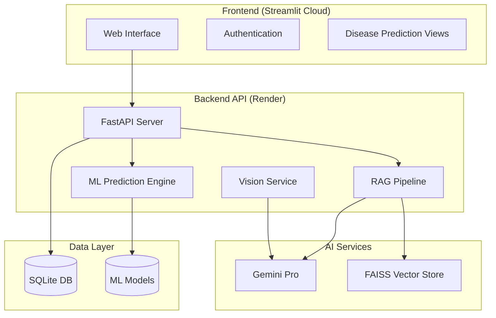

<p align="center">
  
</p>

<h1 align="center">AI Healthcare System</h1>
<p align="center">
  <strong>Disease Prediction & Medical Assistance Platform</strong>
</p>

<p align="center">
  <a href="https://ai-healthcare-system.streamlit.app/">
    
  </a>
  
  
  
</p>

---

## 🎯 Overview

A production-grade healthcare platform that combines **Machine Learning** for disease prediction with **Generative AI** for intelligent medical assistance. Built with a modern microservices architecture, the system provides preliminary health assessments for multiple conditions while maintaining strict data privacy.

**🔗 Live Demo**: [ai-healthcare-system.streamlit.app](https://ai-healthcare-system.streamlit.app/)

---

## 🏗️ Architecture



---

## ✨ Key Features

### 🔬 Multi-Disease Prediction
| Disease | Model | Key Metrics |
|---------|-------|-------------|
| **Diabetes** | XGBoost | Glucose, BMI, Insulin, Age |
| **Heart Disease** | XGBoost | Cholesterol, BP, ECG Results |
| **Liver Disease** | XGBoost | Bilirubin, Albumin, Proteins |
| **Kidney Disease** | Random Forest | Creatinine, Hemoglobin, RBC |
| **Lung Cancer** | Gradient Boosting | Smoking, Chest Pain, Fatigue |

### 🤖 AI-Powered Medical Assistant
- **RAG Architecture**: Retrieval-Augmented Generation using FAISS vector storage
- **Context-Aware Responses**: Grounded in user health records and medical context
- **Conversation Memory**: Persists chat history for continuity

### 📄 Smart Lab Report Analyzer
- **Vision AI**: Extracts data from PDF/Image lab reports using Gemini Vision
- **Automated Insights**: Generates AI explanations for abnormal values

### 🔐 Security & Privacy
- **JWT Authentication**: Secure session management
- **Tenant Isolation**: User data fully separated
- **Rate Limiting**: API abuse prevention

---

## 🚀 Quick Start

### Option 1: Docker (Recommended)
Spin up the entire stack with one command:

```bash
# Clone the repository
git clone https://github.com/pavanbadempet/A-Healthcare-System-using-Machine-Learning-Techniques-for-Disease-Prediction-with-Chatbot-Assistance.git
cd A-Healthcare-System-using-Machine-Learning-Techniques-for-Disease-Prediction-with-Chatbot-Assistance

# Configure environment
cp .env.example .env
# Edit .env and add your GOOGLE_API_KEY

# Launch all services
docker-compose up --build
```

| Service | URL |
|---------|-----|
| **App (Frontend)** | http://localhost:8501 |
| **API Docs** | http://localhost:8000/docs |
| **MLflow UI** | http://localhost:5000 |

### Option 2: Local Development

**Prerequisites**: Python 3.10+, pip

```bash
# Install dependencies
pip install -r requirements.txt

# Start Backend (Terminal 1)
uvicorn backend.main:app --reload --port 8000

# Start Frontend (Terminal 2)
streamlit run frontend/main.py
```

### Option 3: Quick Scripts (Windows)
```powershell
# Run everything
.\scripts\runners\run_app.bat

# Run E2E tests
.\scripts\runners\run_e2e_tests.ps1
```

---

## 🛠️ Technology Stack

| Layer | Technology | Purpose |
|-------|------------|---------|
| **Frontend** | Streamlit | Responsive UI & Data Visualization |
| **Backend** | FastAPI, Pydantic | REST API & Request Validation |
| **ML/AI** | XGBoost, Scikit-Learn | Disease Classification Models |
| **GenAI** | Gemini Pro, LangChain | Chat Assistant & RAG Pipeline |
| **Vector DB** | FAISS | Semantic Search & Memory |
| **Database** | SQLite | User Data & Chat History |
| **DevOps** | Docker, GitHub Actions | Containerization & CI/CD |
| **Hosting** | Streamlit Cloud, Render | Production Deployment |

---

## 🧪 Testing

```bash
# Run all tests with coverage
pytest tests/ --cov=backend --cov-report=term-missing

# Run specific test suites
pytest tests/unit/           # Unit tests
pytest tests/integration/    # Integration tests
pytest tests/e2e/            # End-to-end tests (requires running app)
```

### CI/CD Pipeline
GitHub Actions automatically runs on every push:
- ✅ Unit & Integration Tests
- ✅ Code Coverage Reporting
- ✅ Placeholder Model Generation for CI

---

## 📁 Project Structure

```
├── backend/                # FastAPI backend
│   ├── main.py             # API entrypoint
│   ├── prediction.py       # ML prediction logic
│   ├── agent.py            # AI chat agent
│   ├── rag.py              # RAG pipeline
│   ├── vision_service.py   # Lab report analyzer
│   └── *.pkl               # Trained ML models
├── frontend/               # Streamlit frontend
│   ├── main.py             # App entrypoint
│   ├── views/              # Page components
│   └── components/         # Reusable UI components
├── mlops/                  # MLOps pipeline
│   ├── data_ingestion.py   # Data loading
│   ├── data_processing.py  # Feature engineering
│   └── model_training.py   # Training scripts
├── tests/                  # Test suites
│   ├── unit/               # Unit tests
│   ├── integration/        # API integration tests
│   └── e2e/                # End-to-end tests
├── scripts/                # Utility scripts
├── docker-compose.yml      # Multi-container setup
└── render.yaml             # Render deployment config
```

---

## 🌐 Deployment

### Frontend (Streamlit Cloud)
1. Fork/Push to GitHub
2. Connect repository to [Streamlit Cloud](https://streamlit.io/cloud)
3. Set `BACKEND_URL` environment variable

### Backend (Render)
1. Connect repository to [Render](https://render.com)
2. Uses `render.yaml` for auto-configuration
3. Set required environment variables:
   - `GOOGLE_API_KEY` - Gemini API key
   - `SECRET_KEY` - JWT signing key

---

## 🤝 Contributing

Contributions are welcome! Please check [CONTRIBUTING.md](CONTRIBUTING.md) for guidelines.

1. Fork the repository
2. Create a feature branch (`git checkout -b feature/amazing-feature`)
3. Commit your changes (`git commit -m 'Add amazing feature'`)
4. Push to the branch (`git push origin feature/amazing-feature`)
5. Open a Pull Request

---

## 📄 License

This project is licensed under the MIT License - see the [LICENSE](LICENSE) file for details.

---

<p align="center">
  <sub>Built with ❤️ by <a href="https://github.com/pavanbadempet">Pavan Badempet</a></sub>
</p>
