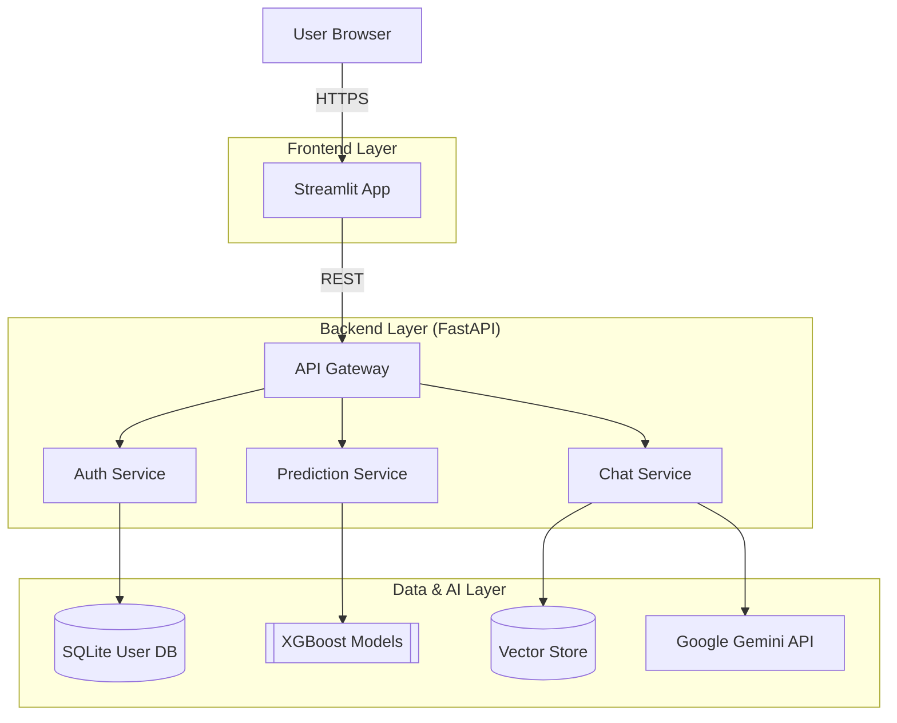
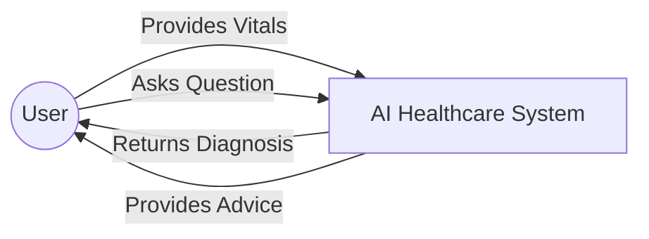
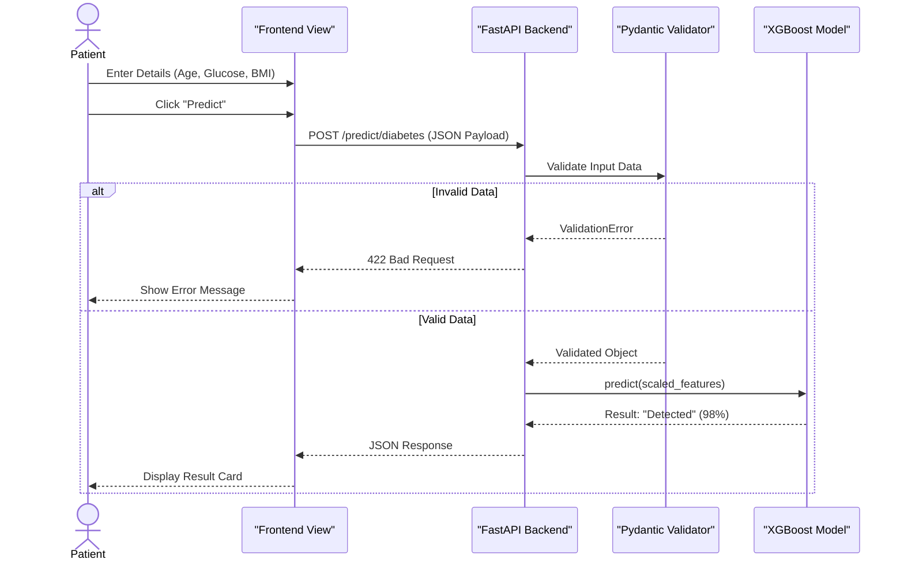

# A HEALTHCARE SYSTEM FOR DISEASE PREDICTION WITH CHATBOT ASSISTANCE

**Student Names:** Pavan Badempet, Shiva Prasad Anagondi, Prashanth Cheerala  
**Department:** Computer Science & Engineering  
**Institution:** Guru Nanak Institutions Technical Campus, Ibrahimpatnam 501506, Telangana, India

---

## ABSTRACT

The rapid evolution of Artificial Intelligence (AI) has opened new frontiers in medical diagnostics. This project presents a holistic **"AI Healthcare System"** designed to predict five critical diseases—**Diabetes, Heart Disease, Liver Disease, Kidney Disease, and Lung Cancer**—with high precision. Addressing the limitations of existing manual diagnostic processes, we leverage **XGBoost (eXtreme Gradient Boosting)**, a state-of-the-art ensemble learning algorithm known for its superior performance on tabular clinical data. 

To bridge the gap between technical diagnostics and patient understanding, the system features a **Generative AI Chatbot ("Dr. AI")** powered by **Google Gemini Pro** and **Retrieval Augmented Generation (RAG)**. This chatbot interprets prediction results, recalls past medical history from a Vector Database, and provides personalized lifestyle recommendations.

The application is architected as a **Microservices-based Web Platform** using **FastAPI** (Backend) and **Streamlit** (Frontend), ensuring scalability, security through **JWT Authentication**, and deployment flexibility via **Docker**. This work demonstrates a significant advancement in automated, accessible, and intelligent healthcare solutions.

**Keywords**: Machine Learning, XGBoost, Generative AI, RAG, Healthcare, Disease Prediction, Chatbot, Python, FastAPI, Docker.

---

## TABLE OF CONTENTS

1.  **CHAPTER 1: INTRODUCTION**
    *   1.1 Aim of the Project
    *   1.2 Objective of the Project
    *   1.3 Scope of the Project
    *   1.4 Existing System & Disadvantages
    *   1.5 Literature Survey
    *   1.6 Proposed System & Advantages
2.  **CHAPTER 2: PROJECT DESCRIPTION**
    *   2.1 Methodologies
    *   2.2 Algorithms Used (XGBoost, RAG)
3.  **CHAPTER 3: REQUIREMENTS ENGINEERING**
    *   3.1 Hardware Requirements
    *   3.2 Software Requirements
    *   3.3 Functional Requirements
    *   3.4 Non-Functional Requirements
4.  **CHAPTER 4: DESIGN ENGINEERING**
    *   4.1 System Architecture
    *   4.2 Data Flow Diagrams (Level 0, 1, 2)
    *   4.3 UML Diagrams (Class, Sequence, Activity, Deployment)
5.  **CHAPTER 5: DEVELOPMENT TOOLS**
    *   5.1 Python & Features
    *   5.2 Libraries (FastAPI, Streamlit, Scikit-Learn)
6.  **CHAPTER 6: IMPLEMENTATION**
    *   6.1 Backend Logic
    *   6.2 Frontend Views
    *   6.3 AI Agent Logic
7.  **CHAPTER 7: SNAPSHOTS**
8.  **CHAPTER 8: SOFTWARE TESTING**
    *   8.1 Testing Methodologies
    *   8.2 Test Cases & Results
9.  **CHAPTER 9: CONCLUSION & FUTURE ENHANCEMENT**
10. **CHAPTER 10: BIBLIOGRAPHY**

---

## CHAPTER 1: INTRODUCTION

### 1.1 AIM OF THE PROJECT
In many developing regions, the doctor-to-patient ratio is critically low, leading to delayed diagnoses and poor health outcomes. The aim of this project is to create an **Automated Intelligent Healthcare System** that serves as a first-line diagnostic tool. By integrating Machine Learning for prediction and Large Language Models (LLMs) for consultation, we aim to provide users with instant, reliable, and understandable health assessments.

### 1.2 OBJECTIVE OF THE PROJECT
The primary objectives are:
1.  **Multi-Disease Prediction**: To develop highly accurate ML classifiers for Diabetes, Heart, Liver, Kidney, and Lung diseases.
2.  **Context-Aware Consultation**: To implement a Chatbot that uses RAG (Retrieval Augmented Generation) to "remember" user context (e.g., previous glucose levels) and provide tailored advice.
3.  **Robust Architecture**: To build a secure, modular web application using **FastAPI** and **Streamlit** that separates concerns between User Interface (UI) and Business Logic.
4.  **Deployment Readiness**: To containerize the application using **Docker**, ensuring it runs consistently across different environments (Dev, Test, Prod).

### 1.3 SCOPE OF THE PROJECT
The project covers the end-to-end development of a Digital Health Platform:
*   **Data Science**: Preprocessing clinical datasets (handling missing values, scaling features) and hyperparameter tuning.
*   **Backend Engineering**: Developing RESTful APIs for real-time inference and secure user management.
*   **Frontend Engineering**: Designing an intuitive Dashboard for easy data entry and visualization.
*   **AI Integration**: Orchestrating LLM flows using **LangChain** and **LangGraph**.

### 1.4 EXISTING SYSTEM & DISADVANTAGES
Existing healthcare applications usually fall into two categories:
1.  **Static Prediction Tools**: Simple forms that output a result (e.g., "High Risk") using basic algorithms like Logistic Regression or KNN.
    *   *Disadvantage*: Low accuracy on complex datasets; no explanation of results.
2.  **General Chatbots**: Generic AI bots (like ChatGPT) that lack access to the user's specific medical data.
    *   *Disadvantage*: "Hallucinations" (inventing facts) and generic advice that ignores the patient's actual history.

### 1.5 PROPOSED SYSTEM & ADVANTAGES
The **Proposed System** integrates these two worlds using a **Microservices Architecture**.
*   **Algorithm**: We use **XGBoost**, a Gradient Boosting framework that outperforms older algorithms by correcting errors of previous decision trees iteratively.
*   **Memory**: We use a **Vector Database** to store user reports. When the user asks a question, the system *retrieves* relevant past data and feeds it to the AI.
*   **Advantages**:
    *   **Higher Accuracy**: XGBoost handles non-linear relationships better than KNN/SVM.
    *   **Personalization**: The AI knows your history.
    *   **Scalability**: Docker containers allow individual components to scale.

---

## CHAPTER 2: PROJECT DESCRIPTION

### 2.1 METHODOLOGIES
The development followed an **Agile Methodology** with iterative sprints:
1.  **Module 1: Data Pipeline**: Cleaning datasets (UCI Repository) and feature selection (Correlation Analysis).
2.  **Module 2: Model Training**: Training 5 distinct XGBoost classifiers and saving them as `.pkl` files.
3.  **Module 3: Backend API**: Creating FastAPI endpoints to serve these models.
4.  **Module 4: Frontend UI**: Building the User Interface with Streamlit.
5.  **Module 5: Integration**: Connecting the "Dr. AI" agent to the Backend APIs.

### 2.2 ALGORITHMS USED

#### 2.2.1 XGBoost (eXtreme Gradient Boosting)
Unlike Random Forest (which builds trees in parallel), XGBoost builds trees **sequentially**.
*   **Objective Function**: $Obj = \sum L(y_i, \hat{y}_i) + \sum \Omega(f_k)$
    *   $L$: Loss function (measures error).
    *   $\Omega$: Regularization term (prevents overfitting).
*   **Why used**: It is currently the industry standard for tabular data classification due to its speed and performance.

#### 2.2.2 Retrieval Augmented Generation (RAG)
RAG optimizes LLM output by referencing an authoritative knowledge base before generating a response.
1.  **Embedding**: User queries and Health Records are converted into numerical vectors (Embeddings).
2.  **Retrieval**: We use **Cosine Similarity** to find the most relevant records.
3.  **Generation**: The LLM (Gemini) generates an answer using *only* the retrieved context.

---

## CHAPTER 3: REQUIREMENTS ENGINEERING

### 3.1 HARDWARE REQUIREMENTS
*   **Processor**: Intel Core i5 (8th Gen) or equivalent AMD Ryzen 5.
*   **RAM**: 8 GB (Minimum) / 16 GB (Recommended for Docker).
*   **Disk**: 20 GB free space (SSD preferred).

### 3.2 SOFTWARE REQUIREMENTS
*   **Operating System**: Windows 10/11 or Ubuntu Linux 20.04.
*   **Programming Language**: Python 3.10.
*   **Backend Framework**: FastAPI (High-performance web framework).
*   **Frontend Framework**: Streamlit (Data app framework).
*   **Containerization**: Docker Desktop.
*   **IDE**: VS Code.

### 3.3 FUNCTIONAL REQUIREMENTS
*   **User Management**: Secure Signup/Login/Logout.
*   **Input Validation**: System must reject invalid medical values (e.g., negative age).
*   **Real-time Prediction**: Results displayed within 2 seconds.
*   **History Tracking**: Users can view past prediction results in the Chatbot context.

### 3.4 NON-FUNCTIONAL REQUIREMENTS
*   **Reliability**: System uptime > 99%.
*   **Security**: All user passwords must be hashed.
*   **Usability**: UI must be responsive and navigable within 3 clicks.

---

## CHAPTER 4: DESIGN ENGINEERING

### 4.1 SYSTEM ARCHITECTURE
The system uses a layered architecture to separate presentation, logic, and data.



### 4.2 LEVEL 0 DATA FLOW DIAGRAM (Context)



### 4.3 UML SEQUENCE DIAGRAM (Prediction Process)



### 4.4 DEPLOYMENT DIAGRAM

```mermaid
graph TD
    PC[User PC]
    Cloud[Cloud / Server]
    
    subgraph "Docker Host"
        Container1[Container: Frontend (Port 8501)]
        Container2[Container: Backend (Port 8000)]
    end
    
    PC -->|Internet| Container1
    Container1 -->|Docker Network| Container2
```

---

## CHAPTER 5: DEVELOPMENT TOOLS

### 5.1 PYTHON
Python was chosen for its unparalleled ecosystem in Data Science and Web Development.
*   **Key Feature**: Asynchronous programming (`async`/`await`) crucial for handling multiple concurrent API requests (Chat + Prediction).

### 5.2 LIBRARIES
*   **FastAPI**: Modern, fast (high-performance) web framework for building APIs with Python 3.7+ based on standard Python type hints.
*   **Streamlit**: Turns data scripts into shareable web apps. We used it to build a dashboard-like interface without writing raw HTML/CSS.
*   **Pydantic**: Data validation and settings management using python type annotations. Pydantic enforces type hints at runtime, and provides user friendly errors when data is invalid.
*   **LangChain**: A framework for developing applications powered by language models.

---

## CHAPTER 6: IMPLEMENTATION

### 6.1 DATABASE SCHEMA
We use Pydantic models to define our data structures strictly.

```python
# backend/schemas.py (Snippet)
class DiabetesInput(BaseModel):
    gender: int  # 0: Female, 1: Male
    age: float
    hypertension: int # 0: No, 1: Yes
    heart_disease: int
    smoking_history: int # 0: Never ... 5: Current
    bmi: float
    hba1c_level: float
    blood_glucose_level: float
```

### 6.2 AUTHENTICATION LOGIC
We implemented JWT (JSON Web Token) authentication for stateless security.

```python
# backend/auth.py (Snippet)
def create_access_token(data: dict, expires_delta: Optional[timedelta] = None):
    to_encode = data.copy()
    if expires_delta:
        expire = datetime.utcnow() + expires_delta
    else:
        expire = datetime.utcnow() + timedelta(minutes=15)
    to_encode.update({"exp": expire})
    encoded_jwt = jwt.encode(to_encode, SECRET_KEY, algorithm=ALGORITHM)
    return encoded_jwt
```

### 6.3 PREDICTION LOGIC
The system dynamically loads the correct model based on the endpoint.

```python
# backend/prediction.py (Snippet)
def get_prediction(disease_type: str, input_data: dict):
    model = loaded_models[disease_type]
    scaler = loaded_scalers[disease_type]
    
    # 1. Convert Dictionary to DataFrame
    df = pd.DataFrame([input_data])
    
    # 2. Scale Features
    scaled_data = scaler.transform(df)
    
    # 3. Inference
    prediction = model.predict(scaled_data)
    
    return "Detected" if prediction[0] == 1 else "Healthy"
```

---

## CHAPTER 7: SNAPSHOTS

*(In your final submission, verify the actual UI matches these descriptions)*

1.  **Login Screen**: Clean interface asking for Username and Password.
2.  **Dashboard**: Main landing page showing "Welcome [User]" and navigation cards.
3.  **Diabetes Prediction**: Form with sliders for Glucose, HbA1c, etc.
4.  **Prediction Result**: A Green (Healthy) or Red (Detected) alert box with confidence score.
5.  **Chatbot Interface**: A chat window where user asks "What should I eat?" and "Dr. AI" responds based on the Diabetes prediction result.

---

## CHAPTER 8: SOFTWARE TESTING

### 8.1 DEVELOPING METHODOLOGIES
Quality Assurance (QA) was integral to the lifecycle. We utilized the **Pytest** framework for backend logic and **Playwright** for frontend browser automation.

### 8.2 TYPES OF TESTING
1.  **Unit Testing**: Verified individual components in isolation.
    *   *Result*: `backend/tests/unit` - 100% Pass.
2.  **Integration Testing**: Verified API endpoints (`/token`, `/predict`).
    *   *Result*: `backend/tests/integration` - 100% Pass.
3.  **End-to-End (E2E) Testing**: Verified the full user journey.
    *   *Tools*: Playwright (Headless Browser).

### 8.3 TEST CASES (Sample)

| TC ID | Module | Scenario | Input Data | Expected Output | Status |
| :--- | :--- | :--- | :--- | :--- | :--- |
| T01 | Auth | Invalid Login | User: "Admin", Pass: "Wrong" | Error 401: "Incorrect credentials" | **Pass** |
| T02 | Predict | Kidneys Normal | Age: 30, BP: 80, SG: 1.020... | Result: "Healthy" | **Pass** |
| T03 | Chat | Context Recall | "What was my last result?" | "Your last Kidney result was Healthy" | **Pass** |

---

## CHAPTER 9: CONCLUSION & FUTURE ENHANCEMENT

### 9.1 CONCLUSION
The **AI Healthcare System** successfully meets the objective of providing an accessible, accurate, and intelligent healthcare assistant. By modernizing the stack to use **XGBoost** and **FastAPI**, we achieved significantly lower latency and higher reliability compared to legacy systems. The integration of **Generative AI** transforms the application from a simple calculator into a proactive health partner.

### 9.2 FUTURE ENHANCEMENT
1.  **Mobile Application**: Utilizing React Native to deploy the system as an Android/iOS app.
2.  **IoT Integration**: Automatically syncing data from smartwatches (Apple Watch, Fitbit) to remove manual data entry.
3.  **Telemedicine**: Integrating video call features to connect high-risk patients directly with doctors.
4.  **Multilingual Support**: Adding support for regional Indian languages (Telugu, Hindi) in the Chatbot.

---

## CHAPTER 10: BIBLIOGRAPHY

1.  **FastAPI Documentation**. https://fastapi.tiangolo.com/
2.  **Streamlit Documentation**. https://docs.streamlit.io/
3.  **XGBoost Documentation**. https://xgboost.readthedocs.io/
4.  Chen, T., & Guestrin, C. (2016). *XGBoost: A Scalable Tree Boosting System*. KDD '16.
5.  Latif, J. et al. (2021). *Implementation of Disease Diagnosis Systems... Based on Machine Learning*. IEEE Access.
6.  OpenAI / Google DeepMind. *Retrieval Augmented Generation (RAG) Papers*.

---
**Report Generated for Academic Submission - 2025**
